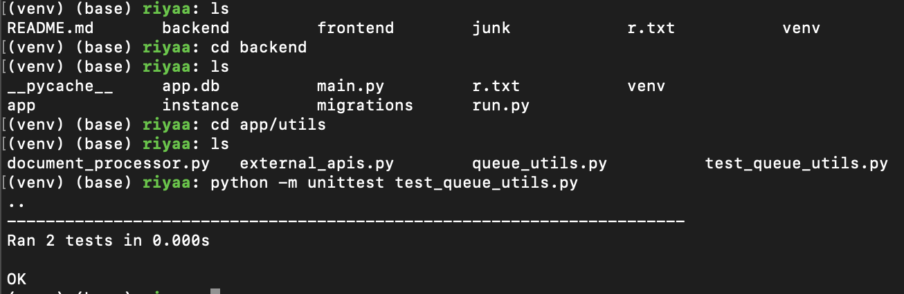

# Queue Utilities Documentation

This folder contains utility scripts related to the queuing system of the Document Sentiment Analyzer project. The queue system is essential for handling asynchronous task processing, ensuring that the application remains responsive and scalable.

Go to main README.md for more on the Queuing System: https://github.com/riya-deokar/Project2/tree/main

## `queue_utils.py`

### Overview

`queue_utils.py` implements the queuing logic necessary for processing document uploads and sentiment analysis in a non-blocking manner. By leveraging Python's queueing libraries, this script enables efficient task scheduling and execution.

### Components

- **Task Queues**: Separate queues for handling different types of tasks (e.g., file processing, NLP analysis).
- **Worker Functions**: Dedicated functions responsible for consuming tasks from the queues and executing them.
- **Queue Manager**: Central management logic for initializing queues, registering tasks, and starting workers.

### Usage

The queue utilities are used within the Flask application to queue up tasks like file uploads and text analysis requests. This decouples heavy processing from the main request-response cycle, improving the web server's throughput and responsiveness.

## `test_queue_utils.py`


### Overview

`test_queue_utils.py` contains unit tests for `queue_utils.py`. These tests ensure that the queuing system behaves as expected under various conditions, maintaining the reliability and stability of the background task processing.

### Test Scenarios

- **Queue Initialization**: Verifies that task queues are correctly initialized.
- **Task Enqueuing**: Checks that tasks can be successfully added to the correct queues.
- **Task Processing**: Tests the execution of tasks by workers, ensuring they are correctly consumed and handled.
- **Error Handling**: Assesses the system's response to invalid tasks or execution errors.

### Running the Tests

To execute the tests, navigate to the project root directory and run the following command:

```bash
python -m unittest Project2/backend/app/utils/test_queue_utils.py
